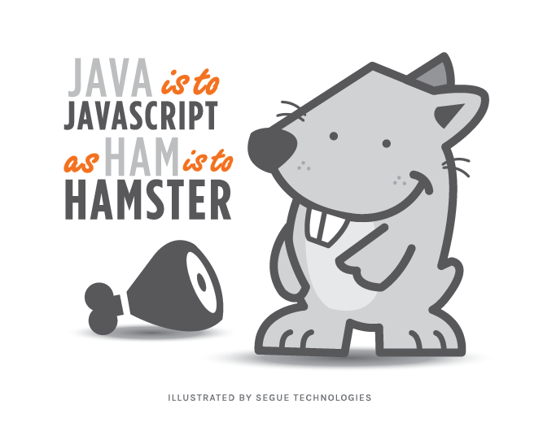

## Javascript en el mundo <span style="color: #e49436">profesional</span>
#### <span style="color: #e49436">¿Quién soy yo?</span>
##### Erick Agrazal
#### <span style="color: #e49436">¿A qué me dedico?</span>
##### A muchas cosas...

---

¿A qué me dedico?
-----------------
###### - All Safe Solutions <span style="color: #e49436">(55%)</span>
###### - Smart Motion <span style="color: #e49436">(20%)</span>
###### - Profesor <span style="color: #e49436">(20%)</span>
###### - Entre otras cosas <span style="color: #e49436">(5%)</span>

---

Javascript != Java
------------------



---

## Vivímos el futuro de la web, y es hermoso.


---

## ¿Cómo llegamos hasta aquí?

---

El inicio fue Flash ...
------------------


---

Flash
-----

- Reproducción de audio y video
- Comunicación en tiempo real
- Animaciones aceleradas por _hardware_
- Una sintaxis similar a **Javascript**
- Un *framework* para crear interfaces 
  gráficas multiplataformas (*Adobe Flex*) 

---

La ilusión no demoró mucho
--------------------------


---

Apple nos hizo retroceder un poco
---------------------------------

>Flash es una tecnología *cerrada*, perteneciente a Adobe, y si las personas continúan usando Flash, pronto Adobe también será dueño de internet. Apple no quiere eso.
- Un "pobre" resúmen de la carta de Steve Jobs


---

Pero nos ofrecieron una solución... ¿Cierto?
--------------------------------------------

```
// ~/Desktop/interface.m

// In @interface
@property (nonatomic, assign) CGFloat lastContentOffset;

//Scroll view delegate methods
- (void)scrollViewDidEndDragging:(UIScrollView *)scrollView willDecelerate:(BOOL)decelerate
{
    if (self.tableView == scrollView) {
        if (scrollView.contentOffset.y - self.lastContentOffset < -90) {
            [self.activeField resignFirstResponder];
        }
    }
}

- (void)scrollViewWillBeginDragging:(UIScrollView *)scrollView {
    if (scrollView != self.tableView) {
        return;
    }

    self.lastContentOffset = scrollView.contentOffset.y;
}
```

---

Nacimiento de HTML5
-------------------


---

Llegó Javascript, cambió el juego
---------------------------------


- European Computer Manufacturers Association <span style="color: #e49436">(ECMA)</span>

---

Javacript en el día de hoy
--------------------------


---

Javacript en el día de hoy
--------------------------

- Frontend
- Backend
- Aplicaciones Móviles
- Apicaciones Locales
- ¡Hasta IoT y Robótica!

---

Frontend
--------


- Jquery... <span style="color: #e49436">Fue genial.</span>
- Angular 1.0 JS
- Angular 2.0 JS
- React JS
- Vue JS

---

Backend
-------

Llegó Node.JS en 2009... <span style="color: #e49436">¡Gracias Ryan Dahl's!</span>


---

Backend
-------


- Express JS
- Sails JS
- Meteor JS

---

Aplicaciones Móviles
--------------------


- React Native
- Titanium

---

Aplicaciones Locales
--------------------


- Electron JS

---

¡Hasta IoT y Robótica!
----------------------


- Jhonny Five JS
- NodeMCU
- Arduino

---

¡Incluso Bases de Datos!
------------------------


- Mongo DB <span style="color: #e49436">(Para las consultas)</span>

---

¿Quién utiliza Javascript?
--------------------------


---

Seguridad en Javascript
-----------------------

- Ataques:
  - XSS <span style="color: #e49436">(Cross-Site Scripting)</span>
  - CSRF <span style="color: #e49436">(Cross-Site Request Forgery)</span>
  - *Básicamente los mismos que los demás lenguajes (Backend)*

---

Seguridad en Javascript (Express)
-----------------------

- HTTPS
- CSURF, <span style="color: #e49436">protección contra CSRF</span>
- XSS

---

Seguridad en Javascript (Express)
-----------------------

- Parametrización de consultas
- SQLMap, <span style="color: #e49436">herramienta para detectar 
  ataques de inyección de SQL</span>
- NMAP y SSLYZE, <span style="color: #e49436">probar
  configuraciones</span> de SSL, métodos de cifrado, llaves
  además de la revisión de la validez de los certificados digitales.

---

No todo es bonito...
-------------------------

- No funciona (tan) bien para cálculos complejos.
  - 2^53-1
- La *fatiga* de JS.

---

¿Dónde aprender Javascript?
---------------------------

- [Freecodecamp](https://www.freecodecamp.org/)
- [Addy Osmany](https://addyosmani.com/resources/essentialjsdesignpatterns/book/)

---

## Para volver a ver la presentación
#### [https://github.com/ErickAgrazal/javascript-in-the-real-world/blob/master/PITCHME.md](https://github.com/ErickAgrazal/javascript-in-the-real-world/blob/master/PITCHME.md)

---

## Conclusión